```rust
struct Person<'a> {
    name: &'a str,
    role: &'a str,
    location: &'a str,
}

let me = Person {
    name: "CBoYXD",
    role: "Python Backend Developer",
    location: "Kharkiv, Ukraine",
};

// Currently learning: Rust for Blockchain 🦀⛓️
```

</div>

<h1 align="center">👋 Hi! I'm Bohdan</h1>
<h3 align="center">Backend Developer | Python Expert | Rust Enthusiast</h3>

<br>

## 📊 GitHub Statistics

<div align="center">
  
  
</div>

<br>

<div align="center">
  
</div>

<br>

<div align="center">
  
</div>

<br>

## 🛠️ Technologies & Tools

<div align="center">
  
  
  
  
  
  
  
  
  
  
  
  
  
</div>

<br>

## 📫 Connect with me

<div align="center">
  <a href="https://discord.com/users/828557294395981854" target="_blank">
    
  </a>
  
  <a href="https://t.me/CBoYXD" target="_blank">
    
  </a>
  
  <a href="mailto:python.rust.cpp@gmail.com">
    
  </a>
</div>
